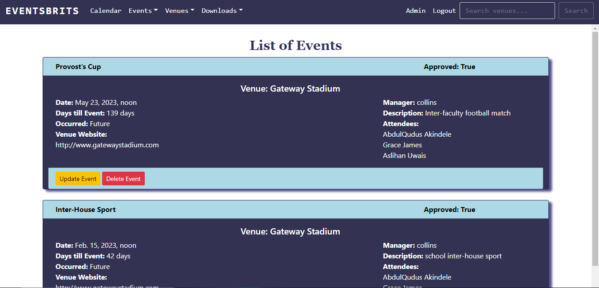
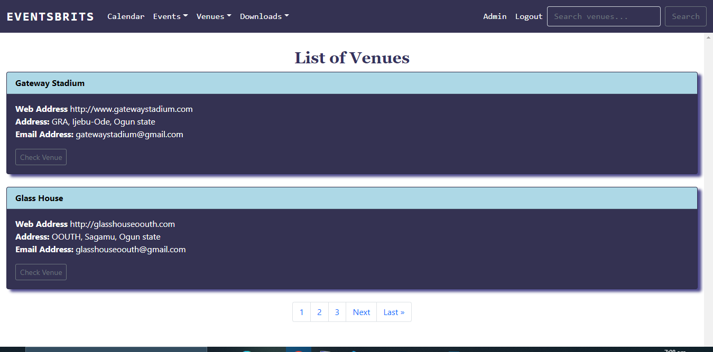
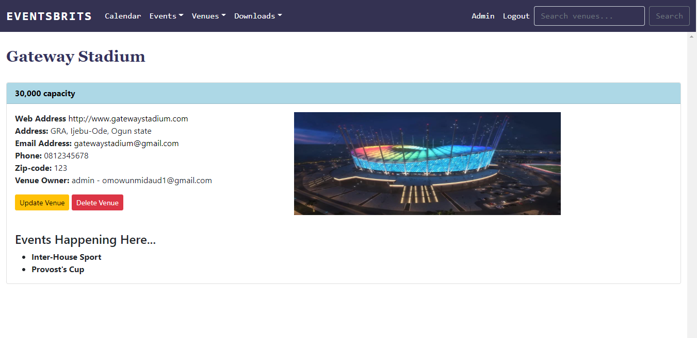

# Eventsbrits

full stack CRUD blog website built with HTML, CSS, Bootstrap, and Django framework. <br />


## Table of contents

- [Overview](#overview)
  - [The challenge](#the-challenge)
  - [Screenshot](#screenshot)
  - [Links](#links)
- [My process](#my-process)
  - [Built with](#built-with)
  - [What I learned](#what-i-learned)
  - [Useful resources](#useful-resources)
- [To use](#usage)

## Overview

### The challenge

Users should be able to:

- Add a venue or event.
- View each venue or event.
- View the calendar.
- Download venue data.
- Login as a user and logout.
- Update and delete venue or event.
- Search for venue or event.
- View the optimal layout for the site depending on their device's screen size

### Screenshot






### Links

- Solution URL: (https://github.com/faozziyyah/events-app)
- Live link: (not yet available)

## My process

### Built with

- HTML
- CSS
- Bootstrap
- Django

### What I learned

- Django authentication and authorization
- How to use the Django Admin
- pagination
- Adding Images

```Python
def all_events(request):
    event_list = Event.objects.all().order_by('-event_date')

    p = Paginator(Event.objects.all().order_by('-event_date'), 2)
    page = request.GET.get('page')
    events = p.get_page(page)
    nums = "a" * events.paginator.num_pages

    return render(request, 'firstapp/eventslist.html', {'event_list': event_list, 'events': events, 'nums': nums})
```

```HTML
<h1 style="text-align:center; margin-top: 1em;">List of Events</h1>
    
    
    <section class="container card" style="background-color: #343252; color: #fff; box-shadow: 7px 5px 5px #504c8d;">

        <div class="row card-header">

            <div class="col-sm-3">
                <strong>{{ event }}</strong>
            </div>

            <div class="col-sm-3 offset-sm-6">
                <strong>Approved: {{ event.approved }}</strong>
            </div>

        </div>
    </section>

```

### Useful resources

- [Django](https://www.djangoproject.com/) - Django makes it easier to build better web apps more quickly and with less code. 
